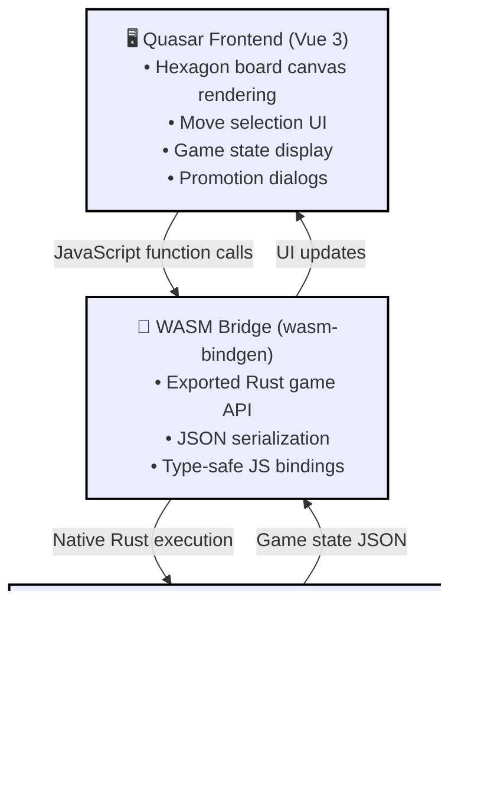

# RustyHexChess: WASM Frontend Integration Plan

## Context

The RustyHexChess Rust engine is feature-complete with move generation, special moves (en passant, promotion), check/checkmate detection, and a solid type-state architecture. Currently it only has console display. This plan outlines building a TypeScript frontend via WASM + localhost to provide an interactive hexagonal chess UI.

## High-Level Architecture



## Implementation Plan

### Phase 1: Create Quasar Frontend Project

**Goal**: Set up Quasar (Vue 3) with TypeScript and project layout

**Steps**:

1. **Create Quasar frontend project**
   - Use Quasar CLI scaffolding: `npm create quasar@latest frontend -- --typescript`
   - Generates project with:
     - Vue 3 + TypeScript setup
     - Quasar components pre-installed (QDialog, QBtn, QCard, etc.)
     - Vite as build tool (same as vanilla, faster rebuilds)
     - Sass support for custom styling

2. **Project structure** (Quasar generates this)
   ```
   /frontend
   ├── package.json
   ├── tsconfig.json
   ├── quasar.config.js
   ├── src/
   │   ├── index.html
   │   ├── App.vue (root component)
   │   ├── main.ts (entry point)
   │   ├── pages/
   │   │   └── Game.vue (main game page)
   │   ├── components/
   │   │   ├── Board.vue (hexagon grid rendering)
   │   │   ├── PromotionDialog.vue (pawn promotion dialog)
   │   │   └── GameInfo.vue (turn display, controls)
   │   ├── composables/ (Vue 3 composition API)
   │   │   └── useGameEngine.ts (WASM wrapper)
   │   ├── boot/
   │   │   └── wasm.ts (initialize WASM on app boot)
   │   └── css/
   │       └── app.scss (custom board styling)
   └── dist/ (build output)
   ```

3. **Configure WASM loading**
   - `src/boot/wasm.ts`: Initialize WASM module on app start
   - `src/composables/useGameEngine.ts`: Wrapper composable for game state & engine calls
   - `quasar.config.js`: Already configured for SPA dev server

4. **Set up local dev server**
   - Quasar default: `npm run dev` → localhost:9000 (or auto-detected port)
   - Hot module reload (HMR) on TS/Vue/SCSS changes
   - WASM auto-rebuilds via root orchestration script

**Critical files**:
- `frontend/src/App.vue` (root component)
- `frontend/src/pages/Game.vue` (main game page)
- `frontend/src/components/Board.vue` (hex rendering)
- `frontend/src/components/PromotionDialog.vue` (promotion UI)
- `frontend/src/composables/useGameEngine.ts` (WASM bridge)
- `frontend/src/boot/wasm.ts` (WASM init)

---

### Phase 2: Hexagonal Board Rendering with Drag & Drop

**Goal**: Render interactive hexagonal chess board with pieces and basic drag-and-drop (no engine logic yet)

**Steps**:

1. **Create `frontend/src/components/Board.vue`** (~400-500 lines)
   - Single File Component (SFC) with `<template>`, `<script setup>`, `<style scoped>`
   - Use **Canvas 2D API** within a `<canvas>` element for rendering
   - Hexagon geometry:
     - Flat-top hexagons (width > height, matches your board layout)
     - Reference engine coordinates from `engine/src/coordinates.rs`
     - Calculate pixel positions using axial math:
       ```
       x = hex_size * (3/2 * col)
       y = hex_size * (√3/2 * col + √3 * row)
       ```
   - Features:
     - Render hexagon grid
     - Render pieces from static board state (no engine yet)
     - Drag & drop any piece to any location
     - Visual feedback: highlight dragged piece, show target hex on hover
     - No validation - pieces can go anywhere
   - Emits: `@pieceMoved(fromPos, toPos)` with new board state

2. **Create `frontend/src/components/GameInfo.vue`** (~100-150 lines)
   - Display basic info: whose turn, move counter
   - Quasar components: `<QCard>`, buttons for "Reset Board"
   - Start simple - no promotion dialogs or advanced status yet
   - Emits: `@resetBoard()`

3. **Piece rendering**
   - Use Unicode chess symbols (♔ ♕ ♖ ♗ ♘ ♙ for white, ♚ ♛ ♜ ♝ ♞ ♟ for black)
   - Render with Canvas text or SVG overlays
   - Color by side (Quasar's theme colors or custom)

4. **Static board state**
   - `frontend/src/composables/useBoardState.ts` - simple reactive ref for board positions
   - Start with standard chess starting position
   - Update state on drag-and-drop, no game rules yet

**Critical files**:
- `frontend/src/components/Board.vue` (new)
- `frontend/src/components/GameInfo.vue` (new)
- `frontend/src/composables/useBoardState.ts` (new)
- `frontend/src/css/app.scss` (custom board styling)

---

### Phase 3: WASM Bindings for Rust Engine

**Goal**: Expose the Rust game API to JavaScript via WASM

**Steps**:

1. **Add WASM dependencies to `engine/Cargo.toml`** (already added)
   - `wasm-bindgen = "0.2"` - Bridge between Rust and JS
   - `wasm-bindgen-futures = "0.4"` - For async support (if needed)
   - `web-sys = "0.3"` - Browser APIs
   - `serde_json` (already present) - JSON serialization

2. **Create `engine/src/wasm.rs`** (~200-300 lines)
   - Public WASM entry point that re-exports the game API
   - Wrapper functions that convert between Rust types and JS-friendly types:
     - Game state as JSON: `fn get_game_state(game: &Game) -> String` → serialize board, current turn, king check status
     - Move result as JSON: `fn make_move(game_json: &str, origin: &str, dest: &str) -> Result<String, String>` → take game state, apply move, return updated state
     - Legal moves as JSON: `fn get_legal_moves(game_json: &str, position: &str) -> Result<String, String>`
     - Promotion: `fn promote(game_json: &str, piece_type: &str) -> Result<String, String>`
   - Create Rust wrapper types with `#[wasm_bindgen]` annotations for types that cross the boundary:
     - `WasmPosition` wrapping hexagonal coordinates
     - `WasmBoard` for serialized board state
   - Use `serde_json` to convert Game state to/from JSON strings for transport

3. **Configure `engine/Cargo.toml` for WASM** (already done)
   - Add `[lib]` to build as both cdylib and rlib
   - Configure for WASM: `crate-type = ["cdylib", "rlib"]`

4. **Test WASM layer locally**
   - Use `wasm-pack build --target web` to generate WASM module
   - Verify exported functions exist in generated `.d.ts` type definitions

**Critical files**: 
- `engine/src/wasm.rs` (new)
- `engine/Cargo.toml` (already updated with wasm-bindgen dependencies)

---

### Phase 4: Game State Management with Real Engine

**Goal**: Replace static board state with actual game engine via WASM, add validation and legal moves

**Steps**:

1. **Create `frontend/src/composables/useGameEngine.ts`** (~150-200 lines)
   - Vue 3 composable wrapping WASM API
   - Import: `import init, * as wasm from '../../engine/pkg'`
   - Exports:
     - `isLoaded: Ref<boolean>` - WASM initialization status
     - `initEngine()` - async load WASM module
     - `newGame()` - return GameState (board, turn, status)
     - `makeMove(game: GameState, origin: string, dest: string)` - returns new GameState or Error
     - `getLegalMoves(game: GameState, pos: string)` - returns Position[]
     - `promote(game: GameState, pieceType: string)` - returns GameState
     - `undoMove(game: GameState)` - returns GameState
   - Cache game state as JSON string for WASM transport

2. **Update `frontend/src/components/Board.vue`**
   - Add legal move highlighting
   - Add move validation against engine
   - Only allow legal moves
   - Highlight selected piece

3. **Add `frontend/src/components/PromotionDialog.vue`** (~80-120 lines)
   - Use Quasar `<QDialog>` component for modal
   - Display 4 promotion options: Queen, Rook, Bishop, Knight
   - Use Quasar `<QBtn>` for selection buttons
   - Emits: `@promote(pieceType)` on selection

4. **Update `frontend/src/pages/Game.vue`** (~250-350 lines)
   - Main game page component using Quasar layout
   - `<script setup>` with composition API:
     - `gameEngine` composable injected
     - `gameState: Ref<GameState>` - reactive game board state
     - `selectedPiece: Ref<Position | null>` - currently selected hex
     - `legalMoves: Ref<Position[]>` - available moves for selected piece
     - `showPromotionDialog: Ref<boolean>` - dialog state
   - Template structure:
     ```
     <q-page class="game-container">
       <Board @hexClicked="onHexClick" :gameState="gameState" :selectedPiece="selectedPiece" :legalMoves="legalMoves" />
       <GameInfo :gameState="gameState" @newGame="onNewGame" @undo="onUndo" />
       <PromotionDialog :show="showPromotionDialog" @promote="onPromote" />
     </q-page>
     ```
   - Methods:
     - `onHexClick(pos: Position)` - handle board clicks, compute legal moves, trigger moves
     - `onPromote(pieceType)` - call engine.promote(), update gameState
     - `onUndo()` - call engine.undo(), update gameState
     - `onNewGame()` - call engine.newGame(), reset dialog state

5. **Create `frontend/src/boot/wasm.ts`** (~50 lines)
   - Quasar boot plugin to initialize WASM on app startup
   - Called before app mounts, ensures engine is ready

**Critical files**:
- `frontend/src/composables/useGameEngine.ts` (new)
- `frontend/src/pages/Game.vue` (new)
- `frontend/src/boot/wasm.ts` (new)
- `frontend/src/components/PromotionDialog.vue` (new)
- `frontend/src/components/Board.vue` (updated)

---

### Phase 5: Build & Deployment Setup

**Goal**: Automate WASM compilation and frontend bundling

**Steps**:

1. **Root `package.json`** (already created with build orchestration)
   - Coordinates building engine WASM and frontend
   - Run `npm run dev` from project root to start dev server

2. **Configure `wasm-pack` output**
   - `engine/Cargo.toml`: Already configured with `name = "engine"`
   - `wasm-pack build` generates `engine/pkg/` with:
     - `engine.wasm` (compiled binary)
     - `engine.js` (JS glue code)
     - `engine.d.ts` (TypeScript definitions)

3. **Frontend build script in `frontend/package.json`** (to be created)
   ```json
   {
     "scripts": {
       "dev": "vite",
       "build": "tsc && vite build",
       "preview": "vite preview"
     }
   }
   ```

**Critical files**:
- `package.json` (root, new or updated)
- `hexagon_logic/Cargo.toml` (add crate-type for WASM)
- `frontend/package.json` (updated)

---

### Phase 6: Local Development & Testing

**Goal**: Verify frontend UI and integration with engine

**Steps**:

1. **Frontend-only testing (Phase 2)**
   ```bash
   npm run dev
   ```
   - Vite dev server reloads browser on TS/CSS changes
   - No WASM required yet

2. **Manual testing checklist - Phase 2 (UI only)**
   - Launch `npm run dev` from frontend directory
   - Wait for "App running at..." message
   - Board renders with hexagon grid and pieces in standard starting position
   - Click and drag any piece to any hex → piece moves, board updates
   - No validation - pieces should move freely
   - "Reset Board" button restores starting position
   - Turn indicator updates (optional - can be added later)

3. **Full integration testing (Phase 4 - after engine coupling)**
   - Launch `npm run dev` from project root (rebuilds WASM, starts dev server)
   - Wait for "App running at..." message
   - Create new game → board renders with all pieces in correct positions
   - Click piece hex → legal moves highlight in different color
   - Click illegal move → board does not update, shows error/highlight
   - Click legal move hex → piece moves, board updates, turn switches
   - Verify capture logic (click enemy piece hex, then click empty destination)
   - Trigger en passant scenario → verify capture behavior
   - Move pawn to promotion rank → PromotionDialog appears
   - Select promotion piece (Queen/Rook/Bishop/Knight) → pawn converts, dialog closes
   - Trigger check state → GameInfo highlights "Check" status
   - Reach checkmate → game ends, "Checkmate" message in GameInfo
   - Click "Undo" button → board reverts, turn switches back
   - Click "New Game" → board resets to starting position

4. **Browser DevTools**
   - Phase 2: Check console for Vue/Quasar warnings
   - Phase 4: Check console for no WASM initialization errors
   - Network tab (Phase 4): verify `engine.wasm` file loaded (~1-3 MB depending on optimization)
   - Vue DevTools (Quasar plugin): inspect component tree, reactive state changes

---

## Technology Choices

| Component | Choice | Why |
|-----------|--------|-----|
| WASM | `wasm-bindgen` + `wasm-pack` | Standard, battle-tested, great TypeScript support |
| Frontend | Quasar (Vue 3 + components) | Pre-built components for dialogs/buttons/UI, polished out-of-box styling |
| Rendering | Canvas 2D | Fast hexagon rendering, easier than SVG for grid |
| Build Tool | Vite | Fast rebuilds, excellent WASM support, simpler config than Webpack |
| State | In-memory JS objects | WASM serialization handles persistence if needed later |

---

## File Structure Summary

```
RustyHexChess/
├── engine/
│   ├── Cargo.toml (WASM dependencies already added)
│   ├── src/
│   │   ├── lib.rs (existing)
│   │   ├── wasm.rs (TODO Phase 3: WASM entry point)
│   │   ├── board.rs (existing)
│   │   ├── piece.rs (existing)
│   │   ├── coordinates.rs (existing)
│   │   └── ... (other modules)
│   └── pkg/ (generated by wasm-pack, do not edit)
│
├── frontend/ (Phase 1: Quasar project)
│   ├── package.json
│   ├── tsconfig.json
│   ├── quasar.config.js
│   ├── src/
│   │   ├── index.html
│   │   ├── main.ts
│   │   ├── App.vue
│   │   ├── pages/
│   │   │   └── Game.vue (Phase 1: main game page - static board)
│   │   ├── components/
│   │   │   ├── Board.vue (Phase 2: hex rendering + drag/drop)
│   │   │   ├── GameInfo.vue (Phase 2: basic info display)
│   │   │   └── PromotionDialog.vue (Phase 4: pawn promotion UI)
│   │   ├── composables/
│   │   │   ├── useBoardState.ts (Phase 2: static board state)
│   │   │   └── useGameEngine.ts (Phase 4: WASM wrapper)
│   │   ├── boot/
│   │   │   └── wasm.ts (Phase 4: WASM initialization plugin)
│   │   └── css/
│   │       └── app.scss (custom styling)
│   └── dist/ (generated build output)
│
├── doc/
│   └── plans/ (documentation)
│
└── package.json (root, coordinates build scripts)
```

---

## Verification & Testing

**Phase 2 (UI only)**:
1. **Type safety**: `npm run build` in frontend should have no TypeScript errors
2. **Development**: `npm run dev` opens browser, board and pieces render
3. **Drag & drop**: Pieces move freely to any hex without validation
4. **Browser DevTools**: No console errors, Vue/Quasar warnings only

**Phase 4 (with engine)**:
1. **WASM compilation**: `npm run build:wasm` should complete without errors
2. **Type safety**: `npm run build` in frontend should have no TypeScript errors
3. **Development**: `npm run dev` opens browser, game is playable with move validation
4. **Manual play-through**: Create game, make 5-10 moves, trigger promotion, verify check detection
5. **Browser DevTools**: No console errors, WASM module loaded and initialized

---

## Next Steps After This Plan

1. ✅ Phase 1 Complete: Quasar v5 frontend project scaffolded with TypeScript + Sass
   - Start dev server: `quasar dev` (runs on http://localhost:5173)
   - npm and quasar CLI on PATH
2. Implement Phase 2 (hexagonal board with drag & drop - no engine yet)
   - Create Board.vue component with static starting position
   - Implement hexagon rendering and piece placement
3. Test UI with static board state, verify pieces can be placed and moved freely
4. Implement Phase 3 (WASM bindings to Rust engine)
5. Implement Phase 4 (connect frontend to real engine with move validation)
6. Add promotion dialog and advanced game features
7. Polish UI/UX based on testing

---

## Notes

- **No networking**: WASM runs entirely in browser, no backend needed
- **Serialization**: Game state passed as JSON strings over WASM boundary (slight performance overhead, but negligible for turn-based game)
- **State persistence**: Can add `localStorage` save/load later if desired
- **Scaling**: If you later want network multiplayer, this architecture can layer a WebSocket server on top without changing the frontend much
