# How a Computer Player Learns Hex Chess by Reinforcement Learning

This document explains the *ideas*. It does not talk about what the engine can
or cannot do today, and it does not list implementation steps — that is the job
of [reinforcement-learning-player.md](reinforcement-learning-player.md). Read this
one first; it gives the vocabulary the plan uses.

The examples are Gliński hex chess as implemented by the `engine` crate: 91
cells, six piece types, two sides, and a `Game` that accepts a move, tells you
whether the game is over, and can undo.

---

## 1. What a "computer player" is

Strip away everything else and a computer player is a function:

```
position  ──►  move
```

There are two classic ways to build that function, and RL is a way of building
the *parts* of it rather than a third, separate way.

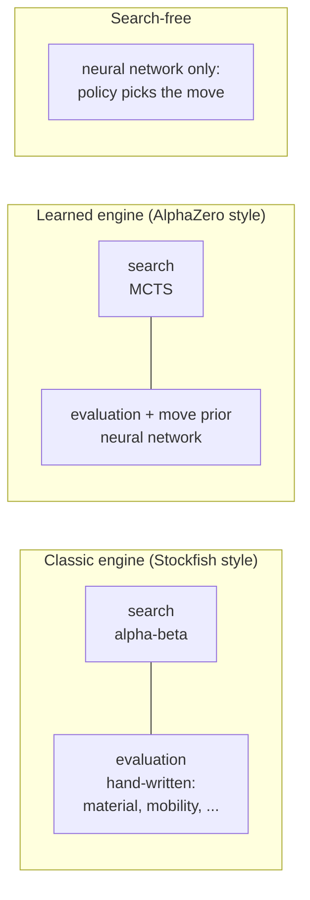

* A **classic engine** looks ahead (search) and, when it stops looking, guesses
  how good a position is (evaluation). Both parts are written by a person.
* A **learned engine** keeps the search but *learns* the evaluation — and often
  also learns which moves are worth searching first.
* A **search-free player** just asks the network "which move?" and plays it.
  Weaker, but it is the purest form of "the network is the player".

Reinforcement learning is the process that fills in the learned boxes without
anybody writing down what a good position looks like. The network figures that
out by playing.

---

## 2. Reinforcement learning in one picture

RL is a loop between an **agent** that acts and an **environment** that responds.

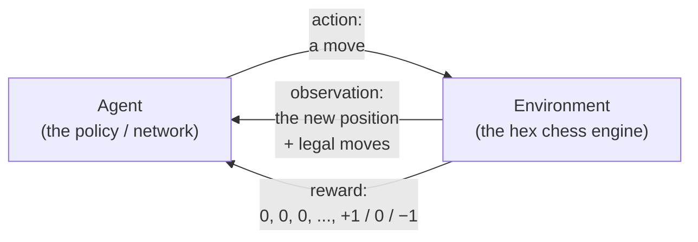

Mapping the standard RL words onto hex chess:

| RL term | In hex chess |
|---|---|
| **Environment** | The engine: it knows the rules, applies moves, says when the game ends. |
| **State / observation** | The position: which pieces stand where, whose turn, en-passant cell, halfmove clock. |
| **Action** | One legal move. |
| **Action mask** | The set of legal moves in this position — the agent must never be allowed to pick anything else. |
| **Reward** | Nothing for 80 moves, then +1 (win), 0 (draw) or −1 (loss). |
| **Episode** | One complete game. |
| **Policy** π(a \| s) | "Given this position, how likely am I to play each move?" — the *player*. |
| **Value** V(s) | "From this position, how is the game likely to end for the side to move?" — a number in [−1, +1]. |
| **Return** | The reward the agent eventually collects; here just the game result. |

Two properties make chess-like games a *hard* instance of this loop:

1. **The reward is sparse.** A whole game of decisions gets one number at the
   end. Which of the 40 moves earned the win? This is the *credit assignment
   problem*, and everything below is, in some sense, a strategy for it.
2. **The opponent is part of the environment.** A fixed opponent would be an
   ordinary RL problem. But we have no opponent — so the agent plays itself.

---

## 3. Self-play: the opponent is you

There is no teacher and no dataset of hex chess games. The agent generates its
own experience by playing against a copy of itself.

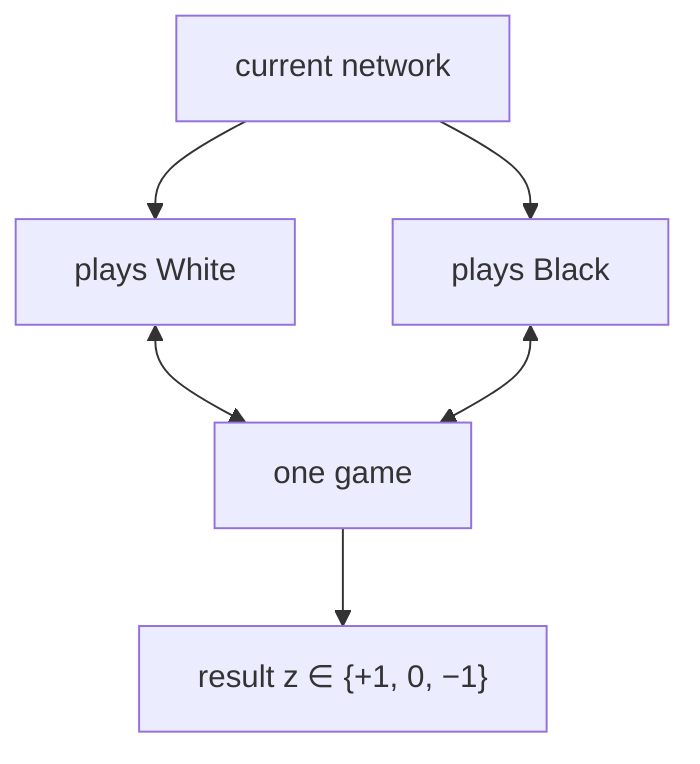

Why this works at all: a policy that is slightly better than random beats a
random policy slightly more often than not. Train on those games and the policy
improves. Now it plays against the *improved* copy, which is a harder opponent,
so the games are more informative, and so on. The opponent moves up exactly as
fast as the agent — a treadmill that never lets the agent coast.

Two consequences are worth knowing before you see them in practice:

* **Every game is played from the mover's point of view.** After a game ends
  with White winning, each White position gets the label "+1" and each Black
  position "−1". The network is always asked "how good is this for *the side to
  move*?" so it learns one policy, not one per colour.
* **Win rate against yourself is not strength.** 55% against last week's
  checkpoint says nothing about whether last week's checkpoint was any good.
  You always need a *fixed* yardstick — a random player, a greedy material
  player, a shallow alpha-beta — that does not move.

---

## 4. From a board to a neural network

A network wants a tensor of numbers, and gives back tensors of numbers. The
translation on both ends is a design decision, not a triviality.

### 4.1 Input: the position as image planes

Hex chess uses axial coordinates: every cell has a `(y, x)` pair, and the 91
cells fit inside an 11 × 11 square with the corners cut off. So a position can
be drawn as a small "image" with one channel (plane) per piece type and colour:

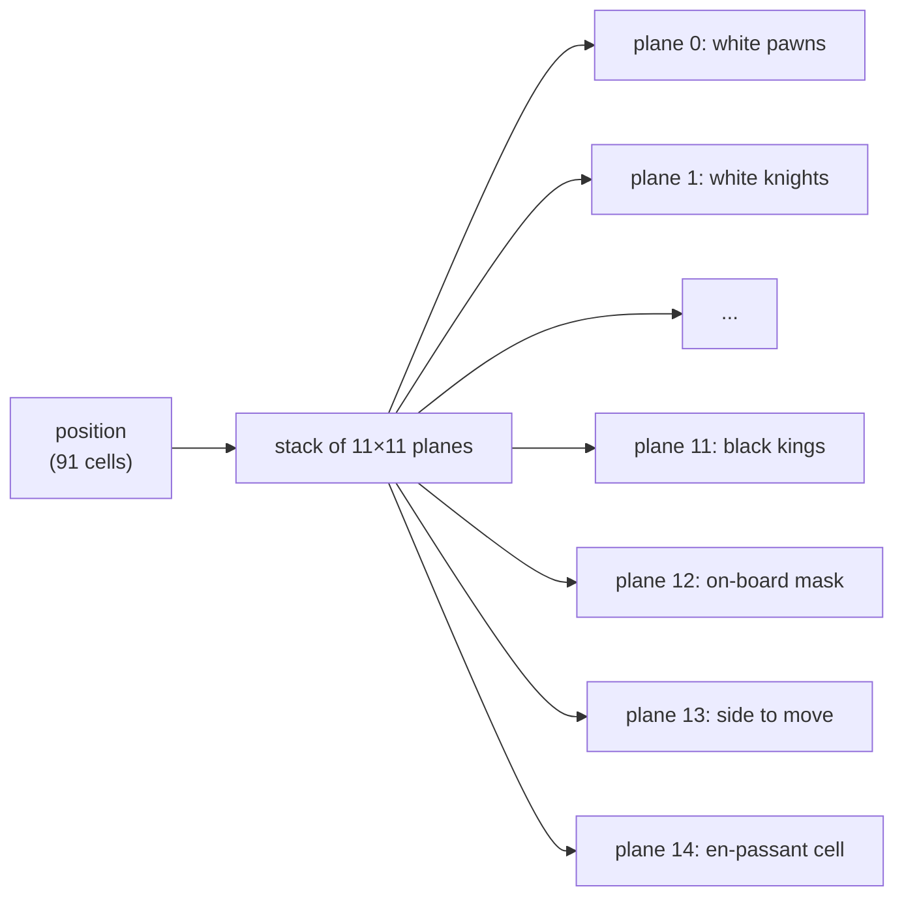

Each plane is 0/1 per cell. Off-board corners are always 0. Extra planes carry
the bits of state that are not visible on the board (whose move, en-passant,
halfmove clock).

**Why square convolutions work on a hex board.** In axial coordinates each cell's
six neighbours are at offsets `(0,±1)`, `(±1,0)`, `(1,−1)`, `(−1,1)`. All six
fall inside a 3 × 3 window around the cell — plus two corners that are *not*
neighbours. A standard 3 × 3 convolution therefore sees the true hex
neighbourhood and learns to ignore the two spurious corners. No hex-specific
layers are needed; the network is an ordinary small ResNet.

### 4.2 Output: policy and value heads

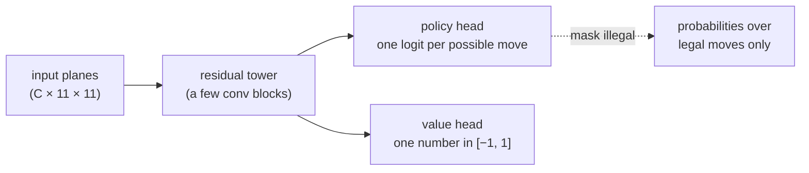

* **Policy head.** One output per *possible* move. The simplest encoding is
  `origin × destination` = 91 × 91 = 8281 slots. Most are never legal (a pawn on
  a1 cannot go to k11), and that is fine: the legal-move mask sets those logits
  to −∞ before the softmax so they get exactly zero probability.
* **Value head.** A single `tanh` output: +1 means "side to move is winning",
  −1 "losing".

A useful mental image: the value head is a learned evaluation function; the
policy head is learned move ordering. Both concepts exist in a classic engine —
this just replaces the hand-written versions.

---

## 5. Turning a game into training examples

After a self-play game, every position becomes one training example:

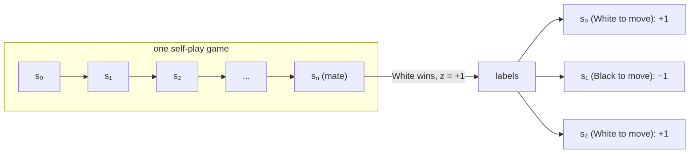

Each example is a triple **(position, π, z)**:

* **position** — the input planes.
* **π** — the *move distribution* the agent actually used at that position
  (what it thought were good moves).
* **z** — the final result, from the mover's point of view.

The network is then trained to make its value head predict **z** and its policy
head predict **π**. That is ordinary supervised learning; the "reinforcement"
part is that the labels came from the agent's own games, and they get better as
the agent does.

Note what this buys against the sparse-reward problem: every position in a won
game is labelled "+1", including the opening ones. The label is noisy —
sometimes a position was terrible and the opponent blundered later — but over
hundreds of thousands of games the noise averages out and the early positions
still get signal.

---

## 6. Where the improvement actually comes from: search

If the network only ever trained on its own moves, it would learn to predict
itself — a fixed point, not an improvement. Something has to produce a *better*
move than the raw policy, so the policy has something to learn from. That
something is search.

### 6.1 Monte Carlo Tree Search (MCTS), in one simulation

Before playing a move, the agent runs a few dozen "simulations". Each one walks
down a tree of positions, adds one new leaf, asks the network about it, and
records what it learned:

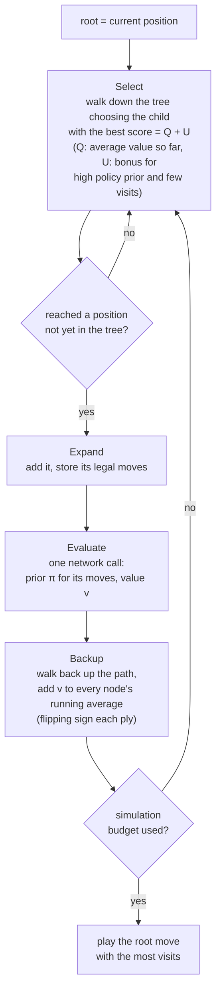

The score `Q + U` is the *PUCT* rule: exploit moves that have looked good
(`Q`), explore moves the network likes but the tree has not tried much (`U`).
The network's job inside search is thus twofold — say which moves deserve
attention (prior), and say how good a leaf looks without playing it out (value).
Neither needs to be very accurate; search corrects both.

After the simulations, the **visit counts** at the root are a better move
distribution than the network's raw prior: they have "seen" a few moves ahead.
That distribution is the **π** stored for training. This is the trick that makes
the whole thing go: *search improves the policy; the policy is trained to match
the search; the better policy makes the search better.*

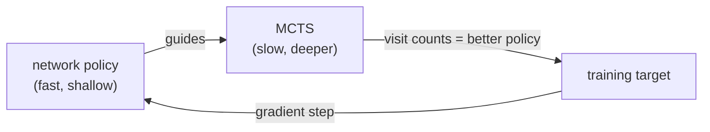

### 6.2 The full AlphaZero-style loop

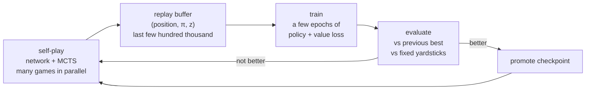

Everything in this diagram is a plain, separable component. You can (and will)
test each one alone: "does self-play produce legal games?", "does training on a
fixed buffer reduce the loss?", "does the evaluation reproduce known results?".

### 6.3 Exploration knobs

Deterministic self-play would produce the same game every time. Two small
sources of randomness keep the data diverse:

* **Temperature.** For the first ~15 plies, pick the move *proportionally* to
  visit counts rather than always the max. Later in the game, play the max.
* **Dirichlet noise at the root.** Mix a little random noise into the prior of
  the root's moves so that occasionally a move the network dislikes gets a look.

---

## 7. Alternatives to the AlphaZero loop

MCTS is the most famous approach but not the only one, and for a learning
project it is worth knowing the landscape.

| Approach | What is learned | What supplies the "better than the policy" signal | Complexity | Ceiling |
|---|---|---|---|---|
| **AlphaZero** (§6) | policy + value | MCTS visit counts | high | high |
| **Policy gradient / PPO** | policy (+ value as critic) | the game result itself, weighted by "was this better than expected?" | medium | lower; slower per game |
| **TD-learning of an evaluation** (TD-Gammon, KnightCap, Giraffe) | value only | the *next* position's value, found by a shallow alpha-beta search | low | mediocre-to-decent; the historic route for chess |

The third row deserves a sentence because it is the most natural fit for a
classic engine skeleton: keep alpha-beta search, replace the hand-written
evaluation with a network, and train the network so that its value of a position
moves toward the value of the position that search finds a few plies later
(*temporal-difference learning*). No MCTS, no policy head, and the resulting
player *is* a classic engine with a learned brain. Its weakness is that
alpha-beta needs a fast engine, because it evaluates far more positions per move
than MCTS.

PPO is the general-purpose workhorse of modern RL. It works here, but without
search each game is a much weaker learning signal, so it needs many more games
to reach the same strength. Its advantage is that the loop is easy to reason
about and every RL library ships a working implementation.

---

## 8. The cold-start problem, and imitation

Two random players almost never checkmate each other. They shuffle until a draw
rule ends the game, and every position gets labelled "0". There is nothing to
learn from that for a long time. This is the single most common reason hobby
chess-RL projects stall.

The standard way around it is to *not* start from random:

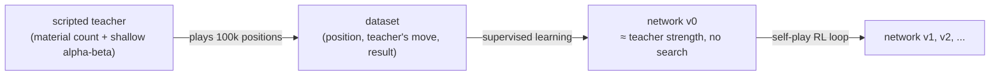

This is **imitation learning** as a warm start. The network first copies a
simple hand-written player; then RL takes over and, because the network can now
actually win games, the reward signal is informative from the first iteration.
A nice side effect: the scripted teacher is also the fixed yardstick from §3.

There is no shame in this. AlphaGo did it; only AlphaZero later showed it was
not *strictly* necessary — at a compute budget nobody at home has.

---

## 9. What the compute is spent on

A training run has two very different kinds of work:

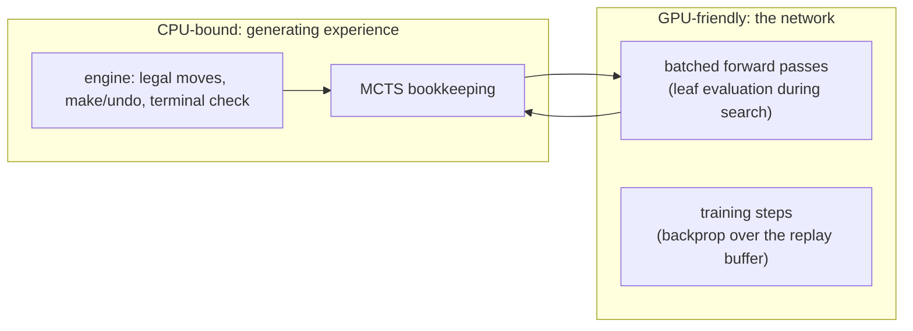

* **Engine speed decides how many games per hour you get.** In an AlphaZero-style
  run, each move costs `simulations × (legal-move generation + one network call)`.
  With 50 simulations and an 80-move game that is 4 000 engine calls and 4 000
  network calls per game. The engine part scales with cores; the network part
  wants a GPU, and wants the calls *batched* — many leaves from many parallel
  games evaluated in one forward pass.
* **Training itself is cheap** at this network size (~1M parameters). Minutes
  per iteration on a laptop GPU, tens of minutes on a CPU.

The practical picture for a small project: a modern multi-core laptop can run
a mediocre-player training loop overnight; renting a machine only shortens the
wait. The plan document discusses the concrete options.

---

## 10. Measuring "is it better?"

Because self-play win rates are relative, evaluation is a first-class part of the
system, not an afterthought:

* **Fixed opponent ladder:** random → greedy material (1-ply) → alpha-beta
  depth 2 → depth 3. Fixed programs never drift.
* **Enough games.** A 60/40 result over 20 games is noise; over 200 games it is
  a signal. Alternate colours.
* **Relative Elo** among your own checkpoints, computed from a round-robin, gives
  a single curve to watch over the whole project.

What "mediocre" looks like in these terms: wins almost always against random,
stops hanging pieces (beats greedy-material most of the time), and holds its own
against 2-ply alpha-beta. That is a player a casual human can lose to, and it is
entirely reachable with home compute.

---

## 11. Glossary

| Term | Meaning |
|---|---|
| **Policy** | A function from position to a probability distribution over moves. |
| **Value** | Expected game result from a position, for the side to move. |
| **Episode** | One game, start to terminal state. |
| **Reward** | The number the environment hands back; here only at game end. |
| **Self-play** | The agent plays both sides against a copy of itself. |
| **Replay buffer** | Store of recent `(position, π, z)` examples used for training. |
| **MCTS** | Monte Carlo Tree Search — builds a lookahead tree guided by the network. |
| **PUCT** | The rule MCTS uses to choose which child to explore (`Q + U`). |
| **Prior** | The network's move probabilities used to bias search before it has data. |
| **Temperature** | How randomly the final move is chosen from visit counts. |
| **Dirichlet noise** | Random perturbation of the root prior for exploration. |
| **Imitation / supervised bootstrap** | Training the network on a scripted player's moves before RL begins. |
| **TD-learning** | Training a value function toward its own estimate a few steps later. |
| **PPO** | Proximal Policy Optimization — a standard search-free policy-gradient algorithm. |
| **Action mask** | Boolean vector marking which action indices are legal in this position. |
| **Checkpoint** | A saved set of network weights at a point in training. |
| **Elo** | Rating scale where a 200-point gap means ~76% expected score for the stronger side. |
