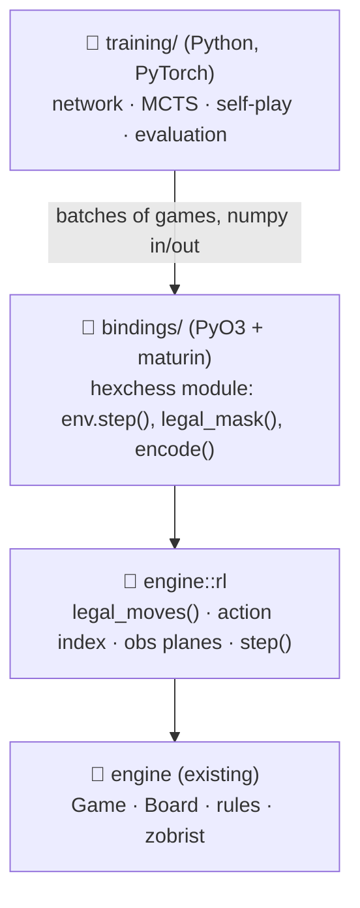

# RustyHexChess: Plan for an RL Computer Player

**Status:** high-level plan, no RL code written yet.
**Companion:** [reinforcement-learning-explainer.md](reinforcement-learning-explainer.md) explains the concepts this plan assumes.
**Goal:** a *mediocre* opponent, built by reinforcement learning, as a learning project. Mediocre means: almost always beats a random mover, rarely hangs pieces, roughly even against a 2-ply alpha-beta. Nothing stronger is wanted.
**Scope:** `engine` (Rust) gets a small RL-facing surface; a new Python project does the learning. The frontend is out of scope until the very end.

---

## 1. Where the engine stands

The engine already has most of what an RL loop needs. The list below is what
matters for this plan, not a general review.

| RL needs | Engine today | Status |
|---|---|---|
| Rules enforced (pinned pieces, check) | [game.rs](../../engine/src/game.rs) `get_movement_options` filters via `move_leaves_king_in_check`; `validate_move` uses it | ✅ done |
| Games always terminate | checkmate, stalemate, threefold, fifty-move, insufficient material in `update_state` | ✅ done (insufficient-material bishop cases still open, harmless for RL) |
| Position hash | [zobrist.rs](../../engine/src/zobrist.rs) `PositionHash` | ✅ done |
| Plain mutable API | `Game` is a flat struct with `GameState::{Normal, Promotion, GameOver}`; `make_move`, `promote`, `undo` | ✅ the typestate refactor the old plan feared is gone |
| A clean outward API | [api.rs](../../engine/src/api.rs) `GameApi` | ✅ exists, but string-based (`"f5"`) — fine for a UI, too slow to drive a training loop |
| **All legal moves for the side to move** | only per piece; `player_has_movement_options` stops at the first one | ❌ missing — the one real gap |
| Fixed move ↔ integer mapping | — | ❌ missing |
| Board → tensor encoding | — | ❌ missing |
| Python access | — | ❌ missing |
| Speed | known O(n²) with allocations, deliberately parked ([TODO.md](../../TODO.md)) | ⚠ unknown; must be measured |
| Rules confidence | no perft, no random-playout test | ⚠ open TODO items |

So the Rust work is additive and small. The bulk of the project is Python — which suits you.

---

## 2. Architecture



Design rules:

* **The game loop stays in Rust; the learning stays in Python.** Python calls
  Rust once per batch of games, not once per move.
* **Do not touch `GameApi` or the wasm surface.** `engine::rl` is a sibling
  facade over `Game`, with integer actions instead of strings.
* **Start with the simplest thing that runs end to end**, then make it fast.
  A single-game env and a naive Python MCTS are the first milestone, not a
  vectorised rayon env.

---

## 3. Phases

Each phase ends with a gate. Passing the gate matters more than the estimates.

### Phase 0 — Know what you have (Rust, ~2 days)

1. **Perft** from the start position, depth 1–4, as a snapshot test. There are no
   published numbers for this variant, so this locks in *current* behaviour
   rather than proving correctness — and that is what protects later speedups.
2. **Random playouts**: 10 000 random games, no panic, every game reaches
   `GameOver`. Record the distribution of game lengths and outcomes — this
   also answers the open "ply cap" question.
3. **Benchmark** (criterion): legal move generation for a mid-game position and
   one full random playout, release mode. Write the two numbers down.

*Gate:* the numbers exist. If a random playout takes more than a few
milliseconds, plan a speed pass for Phase 1; if not, skip it.

### Phase 1 — The RL surface in Rust (~1 week)

New module `engine/src/rl.rs` (or a small `rl/` directory):

* `Game::legal_moves() -> Vec<GameMove>` — the missing bulk generator, built
  from the existing per-piece filter.
* **Action index**: flat `origin × destination`, 91 × 91 = 8281, from a frozen
  enumeration of cells. Round-trip test over all indices. *Freeze it*: changing
  it later invalidates every checkpoint.
* **Observation planes** `(C, 11, 11)`, side-to-move perspective (mirrored for
  Black). Piece planes, on-board mask, side, en-passant, halfmove clock.
* `RlGame { new, reset, step(action) -> (reward, done), legal_mask(), encode() }`.
  `step` auto-promotes to queen so `GameState::Promotion` never reaches the
  agent.
* Scripted opponents, because you need them in every later phase:
  `random`, `greedy` (1-ply material), `alphabeta(depth)` with material +
  mobility. Depth 2–3 alpha-beta is itself a mediocre player and doubles as the
  imitation teacher.

*Gate:* alpha-beta depth 2 beats random ≥ 95% over 200 games, played entirely in Rust.

### Phase 2 — Python bindings (~3 days)

* Workspace crate `bindings/` with PyO3 + maturin, exposing `RlGame` and the
  scripted opponents. Numpy arrays in and out.
* First a single-game `Env`; then `VecEnv(n)` that steps `n` games per call.
  Releasing the GIL and using rayon inside `VecEnv` is the *one* optimisation
  worth doing early, since it multiplies throughput by your core count.
* Python project `training/` with `uv`, PyTorch, numpy. Tests that a random
  agent through the bindings reproduces the Phase 0 statistics.

*Gate:* the same 10 000-random-game statistics, from Python.

### Phase 3 — Supervised bootstrap (~3 days)

The first learning that happens, and it is *not* RL yet on purpose: it
validates the network, the encodings and the training loop with clean labels.

* Generate ~100k positions from alpha-beta self-play (randomised openings,
  ~10 % random moves for diversity), each labelled with the teacher's move and
  the game result.
* Network: small ResNet, ~6 blocks × 64 filters (~1M parameters), policy head
  over 8281 masked logits, value head with `tanh`.
* Train; evaluate the raw policy (no search) on the ladder.

*Gate:* the search-free network beats random ≥ 95 % and greedy ≥ 60 %.
That is already close to "mediocre", achieved by imitation.

### Phase 4 — The RL loop (~2 weeks, open-ended)

The point of the project. Recommended order:

1. **MCTS in Python** over the single-game env, with batched leaf evaluation
   across a handful of parallel games. Slow but transparent — you will want to
   read every line of it once.
2. **Self-play → replay buffer → train → evaluate → promote**, as one script
   with checkpointing, so an overnight run can be resumed.
3. Start from the Phase 3 network. 50 simulations per move, temperature for the
   first 15 plies, Dirichlet noise at the root.
4. Only when it works: move MCTS or the whole self-play worker to Rust if
   throughput is the bottleneck.

Alternative if MCTS feels like too much machinery at first: **PPO** with a
frozen-opponent pool, starting from the Phase 3 network. It is simpler, every RL
library has it, and the bootstrap makes it viable. It plateaus lower, but
"lower" is still within the goal.

*Gate:* a checkpoint that beats the Phase 3 network ≥ 55 % *and* has not lost
ground on the fixed ladder.

### Phase 5 — Evaluation (from Phase 1 onward, not a phase of its own)

* Ladder: random → greedy → alpha-beta d2 → d3. ≥ 200 games per pairing,
  alternating colours.
* Relative Elo from a round-robin of checkpoints (~50 lines of Python).
* One plot: Elo vs training iteration. That plot *is* the project's result.

### Phase 6 — Play against it (optional, later)

Export the network (ONNX) and run it in the browser with `onnxruntime-web`, or
in Rust via a wasm-capable inference crate. Without search it is a few
milliseconds per move; with a shallow MCTS still interactive. Not needed for the
learning goal — just satisfying.

---

## 4. Compute: where to train

The honest sizing first: a ~1M-parameter network with 50 MCTS simulations per
move is a *small* run. Self-play generation is CPU-bound and scales with cores;
training is GPU-friendly but tiny.

| Option | Good for | Rough cost | Notes |
|---|---|---|---|
| **Your own machine** | everything up to Phase 3; overnight Phase 4 runs | free | Start here. If it has 8+ cores, it may be all you need. |
| **Free notebooks** (Google Colab, Kaggle) | Phase 3 training, short Phase 4 experiments | free, limited hours/session | Fine for the GPU part; awkward for long self-play, which needs many CPU cores, not one GPU. |
| **Rented CPU box** (Hetzner Cloud, Contabo, similar) | self-play generation at scale | on the order of a few € per day for 8–16 vCPUs | Best fit for the CPU-bound half. Run the whole loop there; train on CPU if the net is this small. |
| **Rented GPU** (vast.ai, RunPod, Lambda) | if training becomes the bottleneck | on the order of 0.2–0.5 $/h for a consumer GPU | Overkill until measured. Rent by the hour, keep data off the box. |

Recommendation:

1. Build and debug everything locally. Bugs are far cheaper to find at zero
   cost per hour.
2. When Phase 4 works end to end and you want a longer run, rent **one CPU box
   with many cores** for a few days rather than a GPU. The network is small
   enough that CPU training is acceptable, and the self-play throughput is what
   you are paying for.
3. Budget expectation: tens of euros for the whole project, not hundreds.
   Prices above are order-of-magnitude as of writing — check before renting.

Practicalities that save money: containerise the training environment so a
rented box is ready in minutes; write checkpoints and the replay buffer to
object storage or rsync them home; make every script resumable.

---

## 5. Suggested layout

```
RustyHexChess/
├── engine/
│   ├── src/rl.rs            # NEW  legal_moves, action index, obs planes, RlGame
│   ├── src/search.rs        # NEW  random / greedy / alpha-beta opponents
│   └── benches/             # NEW  criterion
├── bindings/                # NEW  PyO3 crate → python module `hexchess`
└── training/                # NEW  python project (uv)
    ├── net.py               # ResNet policy + value
    ├── mcts.py
    ├── selfplay.py
    ├── train.py
    ├── evaluate.py          # ladder + Elo + the plot
    └── bootstrap.py         # Phase 3 dataset + supervised training
```

---

## 6. Risks, in order

1. **Rules bugs.** An agent will find and exploit any hole, and you would train a
   strong player of the wrong game. Perft and random-playout tests (Phase 0) are
   the guard; run them before every optimisation.
2. **Engine too slow for the loop.** Decided by the Phase 0 numbers. Mitigations
   are known and local: flat `[Option<Piece>; 91]` instead of `BTreeMap`, `Copy`
   pieces, cached king position, attack maps.
3. **Cold start.** Handled by the supervised bootstrap (Phase 3). Do not skip it
   to be "pure".
4. **Evaluation noise.** 20-game win rates lie. Enforce ≥ 200 games and a fixed
   ladder from Phase 1 onward.
5. **Scope creep toward strength.** The goal is a working loop and a strength
   curve. Underpromotion, hex-specific insufficient-material tables, and
   bitboards are all out unless a gate demands them.

---

## 7. Open decisions

| Decision | Default | Revisit when |
|---|---|---|
| Ply cap for training games | measure in Phase 0; likely 300 | random-playout length distribution says otherwise |
| MCTS in Python or Rust | Python first | self-play throughput blocks Phase 4 |
| AlphaZero-style vs PPO | AlphaZero-style (it is the concept worth learning) | MCTS becomes a wall; PPO is the fallback, not a failure |
| Local vs rented compute | local until Phase 4 works | a run takes more than one night |
| Where `wasm-bindgen` lives | leave as is | the `bindings/` crate build fights it |
