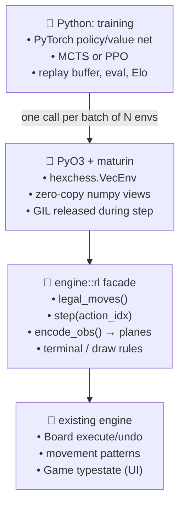
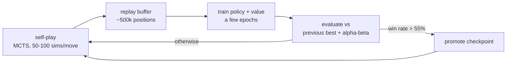

# RustyHexChess: Plan for a Mediocre RL Computer Player

**Status:** proposal, no code written yet.
**Scope:** engine (Rust) + a new Python training project. Frontend is out of scope.
**Goal:** an opponent that reliably beats a random-mover, does not hang pieces for free, and finds one- and two-move tactics. Not a strong engine.

---

## 1. Core question: is the Rust engine suitable for RL?

**Short answer: yes in principle, no as it stands today.** The foundations are right; three specific gaps block a self-play loop, and all three are ordinary work rather than redesign.

### What already works in your favour

| Property | Where | Why it matters for RL |
|---|---|---|
| Make/unmake on the board | [board.rs:204-246](../../engine/src/board.rs#L204-L246) `execute` / `undo` | Tree search and rollouts can mutate in place instead of cloning the whole state per node. This is the single most valuable thing you already have. |
| `Game` and `Board` are `Clone` | [lib.rs:59](../../engine/src/lib.rs#L59), [board.rs:60](../../engine/src/board.rs#L60) | Cheap-enough snapshotting for MCTS roots, replay buffers, and parallel envs. |
| Deterministic board iteration | `BTreeMap<Position, Piece>` | Move generation order is stable, so a move → action-index mapping is reproducible across runs. Reproducibility is what usually breaks first in RL pipelines. |
| Small, readable rule surface | [movement.rs](../../engine/src/movement.rs) is table-driven | Adding a bulk move generator is mechanical, not a rewrite. |
| Legal-move filtering already exists once | [lib.rs:164-190](../../engine/src/lib.rs#L164-L190) `check_king` | The execute → test → undo pattern you need is already written; it just needs to run every turn, not only when in check. |
| Test culture | 18 tests, insta snapshots | Gives you somewhere to hang the correctness work in §3. |

### Blocker A — there is no "all legal moves for the side to move"

`get_movement_options(pos)` works per *piece* ([lib.rs:192](../../engine/src/lib.rs#L192)). Nothing enumerates the whole move list. Every part of an RL system needs that list on every ply: the action mask, MCTS expansion, the policy target, and the terminal test. Today Python would have to loop over 91 cells across FFI to reconstruct it — hundreds of boundary crossings per move.

### Blocker B — the moves that are generated are pseudo-legal

`get_movement_options` does not remove moves that leave your own king in check, and `validate_move` ([lib.rs:301](../../engine/src/lib.rs#L301)) does not consult `check_king`. Consequences:

- A pinned piece can legally be moved away, exposing the king.
- When you *are* in check, `check_king` computes `allowed_moves` — and then nothing enforces them; `make_move` accepts any pseudo-legal move.
- Because a king can therefore be captured, `king_in_check` can hit its `panic!("King is missing on board")` ([lib.rs:152](../../engine/src/lib.rs#L152)).

For a human UI this is a bug you'd notice and fix. For RL it is fatal in a quieter way: the agent will *find* these holes, since exploiting an illegal escape is the cheapest way to avoid losing. You would train a policy against the wrong game.

Two related sharp edges to fix at the same time:

- `get_movement_options` appends `get_en_passant_moves()` unconditionally ([lib.rs:194](../../engine/src/lib.rs#L194)), so asking for a *rook's* moves also returns pawn en-passant moves. `validate_move` then matches only on `destination`, so a rook can be dispatched into a pawn's en-passant move. It also duplicates those moves once per piece inside `check_king`.
- `king_in_check(kings_side)` uses `self.active_side`, not `kings_side`, to locate the king ([lib.rs:149-151](../../engine/src/lib.rs#L149-L151)). Today every call site passes `active_side`, so it is latent — but a legality filter will want to ask about either side.

### Blocker C — games do not terminate

Only checkmate ends a game ([lib.rs:259-271](../../engine/src/lib.rs#L259)). There is no stalemate, no threefold repetition, no fifty-move rule, no insufficient-material draw. Two weak self-play policies will shuffle two kings forever. Without terminal conditions there is no reward signal and no episode boundary, so there is no RL.

### The other thing to know: the typestate API fights a tight loop

`make_move` consumes `self` and returns `NextTurn::{Continued, PromotionRequired, GameOver}` ([lib.rs:324](../../engine/src/lib.rs#L324)). That is genuinely nice for the UI — it is why `doc/type_state_pattern.md` exists — but a self-play loop wants `step(action) -> (obs, reward, done)` with a stable object identity, and threading a moved-and-rebound value through a three-way match a million times per training run is friction with no upside.

**Recommendation: do not refactor the typestate.** Add a thin `engine::rl` facade beside it that owns a `Game` in an `Option`/enum internally and exposes a flat mutable API. The UI keeps its types; RL gets its loop; neither constrains the other.

### Performance: adequate, but measure before you assume

Everything allocates. `pieces_by_side` builds a fresh `HashMap` per call, `get_movement_options` returns a fresh `Vec` per piece with cloned `Piece` values, and `check_king` calls both in a nested loop. A legality filter costs roughly (moves × enemy pieces × moves-per-piece) allocations per ply.

Order-of-magnitude guess for a naive legal generator on this data layout: **a few thousand fully-legal positions/second/core in release mode.** A bitboard engine does millions. For *mediocre* that is survivable — but it decides your algorithm, so measure it first (§3, Step 0) rather than guessing. Cheap wins if the number disappoints: return `SmallVec`, make `Piece` a `Copy` byte, replace `BTreeMap` with a flat `[Option<Piece>; 91]` array indexed by cell id, and cache the king's position.

### Verdict

| Question | Answer |
|---|---|
| Is the architecture suitable? | Yes — make/unmake, clonable state, table-driven rules. |
| Is it usable today? | No — no bulk legal move generation, illegal moves accepted, games never end. |
| Is the fix a rewrite? | No. Roughly 400–600 lines of additive Rust (§3), no change to existing types. |
| Biggest risk? | Not RL at all: it is move-generation *correctness*. A subtly wrong generator produces an agent that is excellent at a game nobody else plays. |
| Second biggest risk? | Cold start. See §5. |

---

## 2. Architecture



The rule that keeps this fast: **the game loop lives in Rust.** Python sends a batch of `N` action indices, Rust steps all `N` games (in parallel via rayon, GIL released) and returns stacked observations, rewards, done flags and legal masks as numpy arrays. One FFI crossing per batch step, not per move. With `N = 256` the Python-side overhead stops mattering and your GPU sees full batches.

Skip JSON-over-stdin and skip reusing the wasm build. `serde` on `Game` is `Serialize` only (no `Deserialize`), and serialising a position per ply would cost more than generating the moves.

---

## 3. Phase 1 — Make the engine RL-ready (Rust, ~1–2 weeks part-time)

This phase contains no machine learning. It is the phase most likely to be rushed, and the one where rushing is most expensive.

### Step 0 — Benchmark first

Add `criterion` and measure, in release mode:
1. Pseudo-legal move generation for a mid-game position.
2. A full random playout to a fixed 200-ply cap.

Write the two numbers down. They pick your algorithm in §5, and they are the baseline for every optimisation afterwards.

### Step 1 — Bulk legal move generation

```rust
// new: engine/src/legal.rs
impl<T> Game<T> {
    /// Every pseudo-legal move for `side`, en-passant included exactly once.
    pub fn pseudo_legal_moves(&self, side: Side) -> Vec<GameMove>;

    /// pseudo_legal_moves filtered by execute → king_in_check → undo.
    pub fn legal_moves(&self) -> Vec<GameMove>;
}
```

`legal_moves` is the same execute/test/undo loop `check_king` already runs — lift it out and run it every ply, not only when in check. While you are in there, move the en-passant generation out of `get_movement_options` so it is emitted once per side rather than once per queried piece.

### Step 2 — Enforce legality and add terminal conditions

- `validate_move` accepts only moves in `legal_moves()`.
- `next_turn` classifies the position after computing `legal_moves()` for the new side to move:

| Condition | Result |
|---|---|
| no legal moves, king in check | checkmate — mover wins |
| no legal moves, king not in check | **stalemate — draw** |
| position seen 3× | **draw** (needs a repetition counter) |
| 100 plies without capture or pawn move | **draw** (needs a halfmove clock) |
| K vs K, K+B vs K, K+N vs K | **draw** |

Add `GameOver { winner: Option<Side> }` or a `Draw` state — draws are currently unrepresentable. Repetition detection wants a Zobrist hash; a plain hash of the `BTreeMap` plus side-to-move is enough to start.

> Gliński hex chess has no castling and a lone bishop covers only one of three colour complexes, so the insufficient-material set differs from orthodox chess. If the fine detail is unclear, ship the first three rules and leave insufficient-material to the ply cap.

### Step 3 — Correctness harness

Standard perft has no published reference numbers for this variant, so lean on self-consistency instead:

- **Perft self-consistency:** node counts at depth 1–4 from the opening. They will not validate absolute correctness, but they lock in behaviour so a later "optimisation" cannot silently change the rules.
- **Property tests** (`proptest`) over random playouts:
  - `execute` then `undo` restores the board bit-for-bit (extend the existing `test_undo`).
  - no move in `legal_moves()` leaves your own king in check.
  - a king is never captured — no `Action::Capture` ever names a `King`.
  - every game reaches a terminal state within the ply cap.
- **10,000 random self-play games** with no panic and no assertion failure. This is the real gate. Run it before you train anything; finding a rules bug after a week of GPU time is a bad afternoon.

### Step 4 — The `engine::rl` facade

```rust
pub struct RlGame { /* wraps Game<NormalTurn> | Game<PromotePawn> | terminal */ }

impl RlGame {
    pub fn new() -> Self;
    pub fn legal_mask(&self, out: &mut [bool; N_ACTIONS]);
    pub fn step(&mut self, action: u16) -> StepResult; // { reward, done, winner }
    pub fn encode(&self, out: &mut [f32]);             // planes, §4
    pub fn reset(&mut self);
}
```

Auto-promote to queen inside `step` so `PromotePawn` never surfaces as an agent decision. Underpromotion is worth roughly nothing at this strength and doubles your action-space headaches; add it later if you ever care.

### Step 5 — Action space

Flat **origin × destination = 91 × 91 = 8281** indices. Cell ids come from a fixed enumeration of the valid `(y, x)` pairs in `X_RANGE` ([coordinates.rs:21](../../engine/src/coordinates.rs#L21)).

It is sparse (~1–2% of indices are ever legal) and that is fine — masking handles it, and it is unambiguous, trivial to invert, and impossible to get subtly wrong. A ray-based encoding (origin × 12 directions × distance) would be ~4× smaller but introduces an off-by-one class of bug that costs more than the parameters it saves. Revisit only if the policy head measurably dominates your training cost.

Freeze this mapping and test it round-trips (`move → index → move`). Changing it later invalidates every checkpoint you have.

---

## 4. Phase 2 — Python bindings and Gym environment (~3–5 days)

### Bindings

`PyO3` + `maturin`, as a second crate `bindings/` in the workspace so the engine crate stays dependency-free.

```python
import hexchess
env = hexchess.VecEnv(n=256)
obs, mask = env.reset()                 # (256, C, 11, 11) f32, (256, 8281) bool
obs, mask, reward, done = env.step(actions)   # actions: (256,) int32
```

Return numpy arrays backed by Rust-owned buffers (`numpy` crate) so nothing is copied. Release the GIL in `step` and drive the inner loop with `rayon` — on 8 cores that is close to an 8× throughput multiplier, and it is the difference between an overnight run and a weekend run.

### Observation encoding

`(C, 11, 11)` float planes over the 11×11 bounding grid, with off-board cells zeroed:

| Planes | Content |
|---|---|
| 0–11 | 6 piece types × 2 sides, one-hot occupancy |
| 12 | on-board mask (the hexagon's ragged edge) |
| 13 | side to move (constant plane) |
| 14 | en-passant target |
| 15 | halfmove clock, normalised |
| 16 | repetition count of the current position |

Always encode **from the side-to-move's perspective** (mirror for Black) so the network learns one policy instead of two.

**On convolutions over a hex board:** the axial `(y, x)` layout already used here has exactly 6 neighbours — `(0,±1)`, `(±1,0)`, `(1,-1)`, `(-1,1)`, per the direction constants in [movement.rs:8-18](../../engine/src/movement.rs#L8-L18). All six fall inside a 3×3 window, so a standard `Conv2d(3,3)` covers the true hex neighbourhood plus two corners that are not adjacent. The network learns to ignore those two. **Ordinary square convolutions are fine here** — you do not need hex-specific layers, and this is the main reason a square-grid architecture transfers to this game at all.

### Sanity gate before any training

A `RandomAgent` playing 1,000 games through the Python bindings, with results matching pure-Rust random self-play statistically. If the two disagree, the bug is in the bindings, and you want to know that now.

---

## 5. Phase 3 — Training

### The cold-start problem, and why to sidestep it

Pure self-play RL from random initialisation on a game with ~50–100 legal moves per position and a reward that only arrives at checkmate is a *hard* exploration problem. Random players essentially never checkmate each other; they hit the ply cap and draw. Your learning signal is close to zero for a long time, and this is the specific reason most hobby chess-RL projects stall.

**Recommended: bootstrap by imitation, then improve by RL.**

#### Stage A — Search-based teacher (~2 days)

Write a plain alpha-beta searcher in Rust: material values (P 1, N 3, B 3, R 5, Q 9), a small mobility bonus, alpha-beta with move ordering (captures first, MVV-LVA), depth 3.

Two things fall out of this, both of which you need anyway:

1. **A benchmark opponent.** Without a fixed reference you cannot tell improvement from drift; self-play win rates measure only relative strength and happily rise while absolute strength falls.
2. **Honest expectations.** Depth-3 alpha-beta with material eval *is already a mediocre player*. If "mediocre" is genuinely the goal, this phase alone delivers it in ~2 days. Everything after it is because you want to build an RL system — which is a completely legitimate reason, and worth naming out loud so the RL phases are judged as learning-and-fun rather than as the cheapest route to the stated goal.

#### Stage B — Supervised bootstrap (~2 days + a few GPU-hours)

Generate ~100k positions of depth-3 self-play (with randomised openings and ~10% random moves for diversity). Train the network on two heads:
- **policy** → cross-entropy against the teacher's chosen move
- **value** → MSE against the game's final result

Network: ResNet, 6 blocks × 64 filters, ~1M parameters. Small enough to train on a single consumer GPU (or patiently on CPU), large enough for this task.

You now have a network that plays at roughly teacher strength *without any search*. Cold start solved.

#### Stage C — AlphaZero-style self-play loop (open-ended)



- **MCTS:** PUCT, Dirichlet noise at the root, temperature 1.0 for the first ~15 plies then near-0. 50–100 simulations per move — Stage B's prior is good enough that you do not need AlphaZero's 800.
- **Where MCTS runs:** implement it in Rust if the Step-0 benchmark says the engine is slow, in Python (numpy, batched leaf evaluation) if it is fast. Batched leaf evaluation across parallel games is what keeps the GPU busy; single-game MCTS will leave it idle ~95% of the time.
- **Sizing:** with 8 cores and one consumer GPU, expect on the order of days for a clear improvement over Stage B. This is the honest number, not a discouragement.

#### Alternative — PPO without search

Simpler to implement, and reasonable if MCTS feels like too much machinery. Self-play with a frozen-opponent pool, reward = game result plus shaped material delta (small coefficient, ~0.01/pawn, decayed toward zero as training progresses). Learns noticeably slower per unit of compute and plateaus lower — but Stage B's bootstrap makes it viable, and it is a good first RL loop if the goal is to learn RL.

### Evaluation

Do this from day one; skipping it is how you end up unable to answer "is it better?"

- **Fixed opponent ladder:** random → greedy-material (depth 1) → alpha-beta depth 2 → depth 3.
- **Relative Elo** from a round-robin among your own checkpoints (`bayeselo`, or ~50 lines of your own).
- ≥200 games per pairing with alternating colours — win rates on 20 games are noise.
- **Milestone definitions:**
  - *Working:* >95% vs random.
  - *Not embarrassing:* >80% vs greedy-material — i.e. it stops hanging pieces.
  - **Mediocre (target): >50% vs alpha-beta depth 2.**
  - *Better than expected:* >50% vs alpha-beta depth 3.

---

## 6. Suggested layout

```
RustyHexChess/
├── engine/                  # unchanged public API
│   └── src/
│       ├── legal.rs         # NEW  bulk legal move generation
│       ├── terminal.rs      # NEW  draws, stalemate, repetition
│       ├── rl.rs            # NEW  RlGame facade, action encoding, obs planes
│       └── search.rs        # NEW  alpha-beta teacher / benchmark opponent
├── bindings/                # NEW  PyO3 crate → `hexchess` python module
└── training/                # NEW  python project (uv or poetry)
    ├── net.py               # ResNet policy+value
    ├── mcts.py
    ├── selfplay.py
    ├── train.py
    └── evaluate.py          # ladder + Elo
```

---

## 7. Ordered checklist

| # | Task | Est. | Gate to pass before moving on |
|---|---|---|---|
| 1 | Criterion benchmarks | 0.5d | Two numbers written down |
| 2 | `pseudo_legal_moves` + `legal_moves` | 2d | Pinned pieces cannot move |
| 3 | En-passant scoping fix; `king_in_check` side fix | 0.5d | Rook can no longer take an en-passant move |
| 4 | Stalemate, repetition, 50-move, ply cap | 1.5d | Every random game terminates |
| 5 | Perft snapshots + proptest suite | 1.5d | 10k random games, zero panics |
| 6 | `RlGame` facade + action encoding | 1.5d | Round-trip test on all 8281 indices |
| 7 | PyO3 bindings + `VecEnv` | 2d | Random agent stats match Rust-side stats |
| 8 | Alpha-beta teacher | 2d | Beats random >95% |
| 9 | Network + supervised bootstrap | 2d | Matches teacher without search |
| 10 | MCTS + self-play loop | 4d | Beats Stage B checkpoint |
| 11 | Eval ladder + Elo | 1d | Reproducible strength curve |

Steps 1–7 are prerequisites regardless of which learning algorithm you pick. **Step 8 alone reaches "mediocre";** 9–11 are how you get there *via reinforcement learning*, which is the actual point.

---

## 8. Open questions

1. **Ply cap for training games.** Suggest 300; needs a look at typical hex-chess game length.
2. **Insufficient material in Gliński hex chess.** The three-colour-complex bishop geometry changes which endings are drawn. Ply cap covers this if the rules are unclear.
3. **Is `wasm-bindgen` staying in `engine/Cargo.toml`?** It is currently a dependency with no `#[wasm_bindgen]` exports anywhere. Out of scope here, but it will be in the way when you split out the `bindings/` crate.
4. **Compute budget.** GPU or CPU-only? CPU-only is entirely workable at this network size, but shifts the recommendation toward PPO over MCTS.
