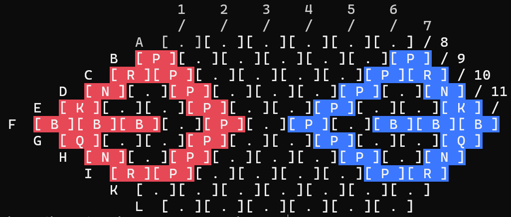

# Hexagon chess in Rust

**Goal** Program the game logic of hexagon chess in rust.

[Hexagonal_chess](https://en.wikipedia.org/wiki/Hexagonal_chess)

## Display in the Terminal

As a first step the game will be rendered in the terminal. It is easier to display rotated 90 degrees:



```text
                          1    2    3    4    5    6
                         /    /    /    /    /    /    7
                    A  [ . ][ . ][ . ][ . ][ . ][ . ] /  8
                 B  [ P ][ . ][ . ][ . ][ . ][ . ][ P ] /  9
              C  [ R ][ P ][ . ][ . ][ . ][ . ][ P ][ R ] /  10
           D  [ N ][ . ][ P ][ . ][ . ][ . ][ P ][ . ][ N ] /  11
        E  [ K ][ . ][ . ][ P ][ . ][ . ][ P ][ . ][ . ][ K ] /
     F  [ B ][ B ][ B ][ . ][ P ][ . ][ P ][ . ][ B ][ B ][ B ]
        G  [ Q ][ . ][ . ][ P ][ . ][ . ][ P ][ . ][ . ][ Q ]
           H  [ N ][ . ][ P ][ . ][ . ][ . ][ P ][ . ][ N ]
              I  [ R ][ P ][ . ][ . ][ . ][ . ][ P ][ R ]
                 K  [ . ][ . ][ . ][ . ][ . ][ . ][ . ]
                    L  [ . ][ . ][ . ][ . ][ . ][ . ]
```
